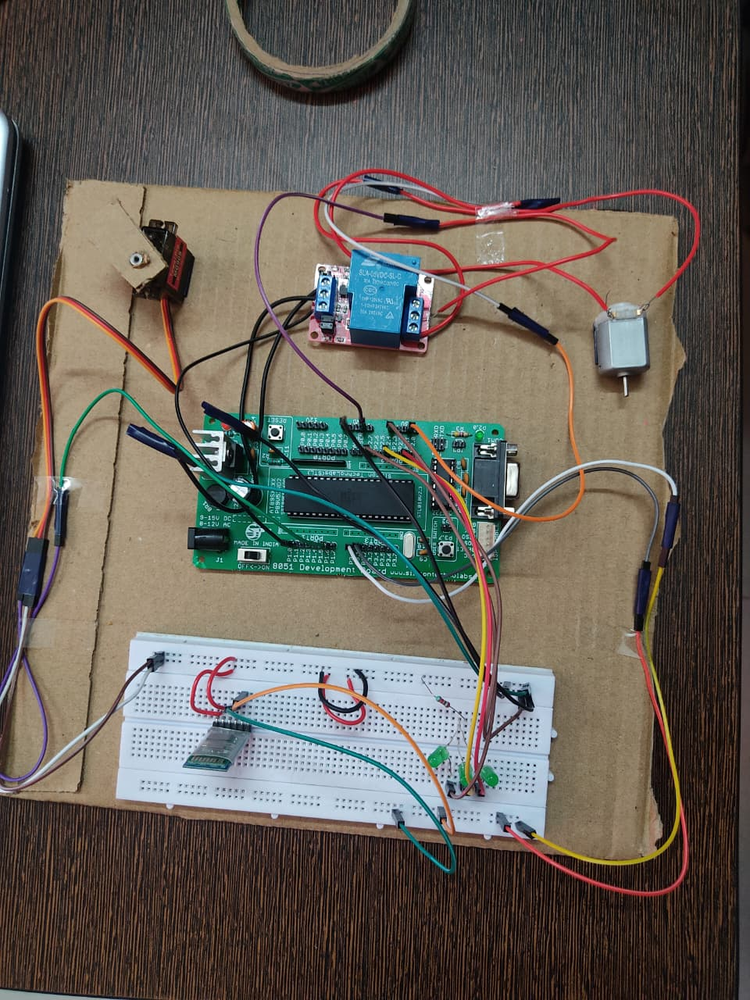

# Smart Home Automation System

A Bluetooth-based smart home automation project combining an **8051 microcontroller**, **HC-05 Bluetooth module**, and a **Flutter Android application**.

The Flutter app sends short ASCII commands over Bluetooth using interactive dashboard controls and **built-in voice commands**. The HC-05 forwards those bytes over UART to the 8051, which controls three LEDs (room lights), a relay module (DC fan), and a servo motor (door/gate).

## Hardware Implementation



*Complete breadboard prototype setup featuring the AT89S52 8051 microcontroller, HC-05 Bluetooth module, 3x LEDs (room lights), relay module (DC fan), and SG90 servo motor (door).*

## Architecture

```text
Flutter Android App
(UI Dashboard & Voice Commands)
        |
        | Bluetooth Classic / RFCOMM
        v
      HC-05
        |
        | UART 9600, 8N1
        v
    AT89S52 / 8051
    |       |        |
  LEDs    Relay    Servo
(Lights)  (Fan)    (Door)
```

## Repository layout

```text
smart-home-automation/
├── app/
│   └── smart_home_app/          # Complete Flutter application
├── firmware/
│   └── 8051/
│       └── src/main.c           # Embedded C firmware
├── docs/
│   ├── command-protocol.md
│   ├── setup-guide.md
│   └── hardware-connections.md
├── hardware/
├── .gitignore
├── LICENSE
└── README.md
```

## Hardware

| Component | Purpose |
|---|---|
| AT89S52 / compatible 8051 | Main microcontroller |
| HC-05 | Bluetooth Classic serial link |
| 3 LEDs | Digital light outputs (Room lights) |
| Relay module | DC Motor / Fan switching |
| Servo motor (SG90) | Position control (Door / Gate) |
| 11.0592 MHz crystal | UART timing (9600 baud) |

### Firmware pin map

| Pin | Function | Controlled Appliance |
|---|---|---|
| P2.1 | LED 1 | Light 1 |
| P2.4 | LED 2 | Light 2 |
| P2.7 | LED 3 | Light 3 |
| P1.0 | Relay | DC Fan / Appliance |
| P1.6 | Servo | Door / Gate (0° = closed, 90° = open) |
| RXD/TXD | HC-05 UART | Bluetooth serial link |

**Hardware safety:** use an appropriate relay module/driver and isolation for mains-powered loads. Do not connect mains voltage directly to the 8051 or breadboard.

## Command protocol

| Byte | Action | Target Appliance |
|---|---|---|
| `1` | Toggle LED 1 | Light 1 |
| `2` | Toggle LED 2 | Light 2 |
| `3` | Toggle LED 3 | Light 3 |
| `R` | Toggle relay | DC Fan |
| `0` | Servo 0° | Door Closed |
| `9` | Servo 90° | Door Open |
| `A` | Increase servo position | Door Step Open |
| `B` | Decrease servo position | Door Step Close |

The firmware sends status strings ending in CR/LF. The Flutter app displays received status messages in the real-time activity log.

### Voice control commands

The Flutter application incorporates speech recognition (`speech_to_text`), allowing hands-free voice automation:

| Voice Command Phrase | Action Triggered | Serial Command |
|---|---|---|
| *"Light 1 on"* / *"Light 1 off"* | Toggle Light 1 | `1` |
| *"Light 2 on"* / *"Light 2 off"* | Toggle Light 2 | `2` |
| *"Light 3 on"* / *"Light 3 off"* | Toggle Light 3 | `3` |
| *"Fan on"* / *"Fan off"* / *"Turn on fan"* | Toggle DC Fan / Relay | `R` |
| *"Servo 0"* / *"Servo off"* | Close Door (Servo 0°) | `0` |
| *"Servo 90"* / *"Servo ninety"* | Open Door (Servo 90°) | `9` |
| *"All on"* / *"All off"* | Master toggle for all appliances | Sequential |

## Run the Flutter app

Open:

```text
app/smart_home_app
```

Then:

```bash
flutter pub get
flutter analyze
flutter test
flutter run
```

Pair the HC-05 in Android Bluetooth settings first.

Default first-launch password:

```text
1234
```

## Build an APK

After installing Flutter and Android SDK:

```bash
cd app/smart_home_app
flutter pub get
flutter build apk --release
```

The generated APK is intentionally **not stored in Git**. It can be rebuilt from source.

## Firmware

Open:

```text
firmware/8051/src/main.c
```

Build it with a suitable 8051 toolchain such as Keil µVision and flash the generated firmware to the controller.

The firmware expects an **11.0592 MHz crystal** for the configured 9600-baud UART.

## Verification status

This repository contains the source needed to build the Flutter application and 8051 firmware. Physical hardware behavior depends on the actual wiring, programmed microcontroller, HC-05 configuration, Android device, and connected loads.

The repository should therefore be treated as **source/build ready**, not as proof that a particular physical hardware setup has been tested.

## License

MIT. See [`LICENSE`](LICENSE).

---

## Author

**Dhruv Rathi**  
GitHub: [@dhruv-rathi-tech](https://github.com/dhruv-rathi-tech)
